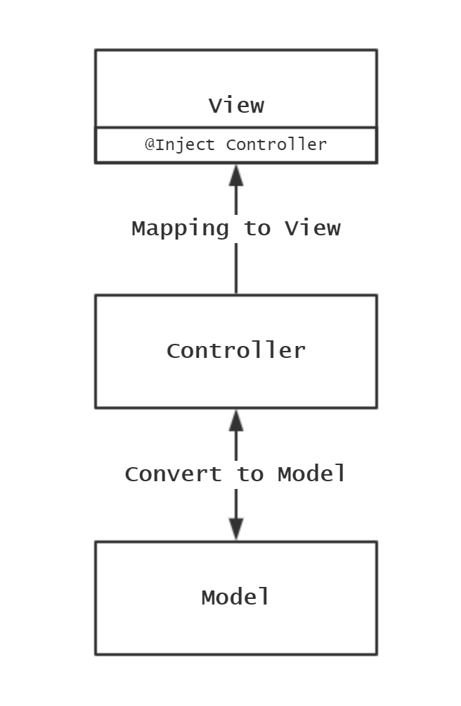
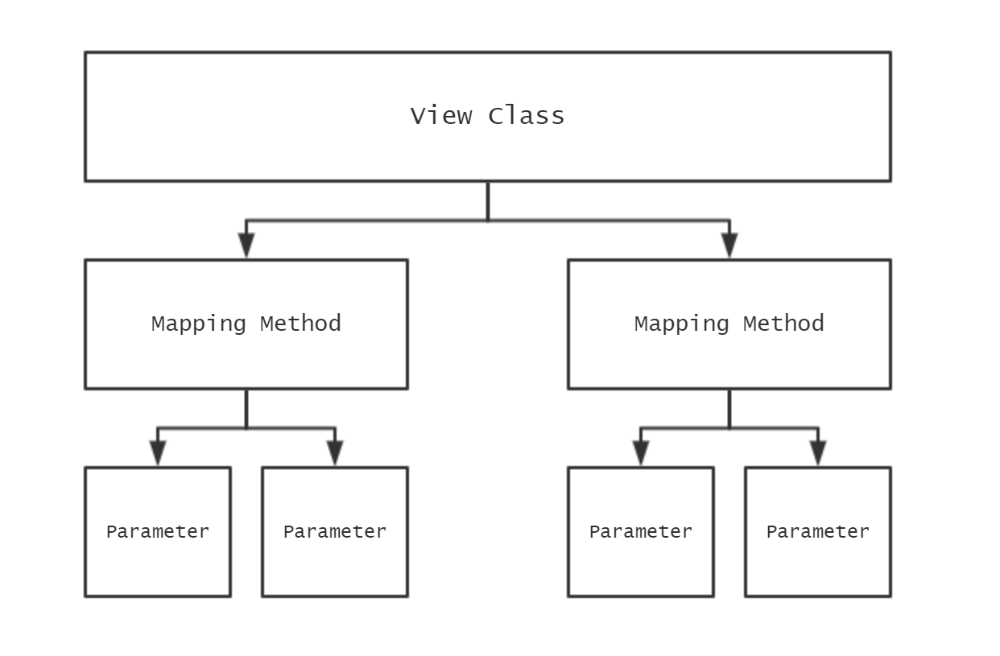

# Rester

Rester is a TypeScript web framework, like Spring Boot, and better use!

# Installation

This project has released on [NPMJS.COM, @rester/core](https://www.npmjs.com/package/@rester/core).

```shell
npm i --save @rester/core
```

# Usage

Let me show you some important features and how to use it.

## Start

### Quick Start

```typescript
const rester = new Rester().listen(); // listening on http://localhost:8080
```

### Load Config

#### MODE = DEV

**rester.dev.json**

```json
{
  "address": {
    "host": "localhost",
    "port": 1234
  }
}
```

**index.ts**

```typescript
const rester = new Rester()
  .load()
  .listen();
```

**command**

```bash
MODE=DEV ts-node index.ts # listening on http://localhost:1234
```

#### MODE = PROD

**rester.json**

```json
{
  "address": {
    "host": "0.0.0.0",
    "port": 80
  }
}
```

**index.ts**

```typescript
const rester = new Rester()
  .load()
  .listen();
```

**command**

```bash
MODE=PROD ts-node index.ts # listening on http://0.0.0.0:80
```

## Decorator

Coding like Spring Boot!



### @View

Use this decorator `@View('/path')` to mark the view.



```typescript
@View()
class DemoView { /* ... */ }

/** Add perfix to all sub mappings. */
@View('/prefix')
class PrefixView { /* ... */ }
```

### Mapping

Use these decorators to mark the mapping.

Such as `@GET('/path')`, `@POST('/where')`, `@PUT('/user')` and so on.

```typescript
@View()
class DemoView {

  @CONNECT('/connect')
  connect() {
    return 'Hello, CONNECT!';
  }

  @DELETE('/delete')
  delete() {
    return 'Hello, DELETE!';
  }

  @GET('/get')
  get() {
    return 'Hello, GET!';
  }

  @HEAD('/head')
  head() {
    return 'Hello, HEAD!';
  }

  @OPTIONS('/options')
  options() {
    return 'Hello, OPTIONS!';
  }

  @PATCH('/patch')
  patch() {
    return 'Hello, PATCH!';
  }

  @POST('/post')
  post() {
    return 'Hello, POST!';
  }

  @PUT('/put')
  put() {
    return 'Hello, PUT!';
  }

  @TRACE('/trace')
  trace() {
    return 'Hello, TRACE!';
  }

}
```

### Parameter

Use these decorators to mark the injectable parameters.

Such as `@PathQuery('key')`, `@PathVariable('key')`, `@RequestBody('application/json')`, `@RequestHeader('header')` and so on.

#### @PathVariable

```typescript
// GET /get/Lily
// return "Hello, Lily!"
@GET('/get/{{name}}')
get(@PathVariable('name') name: string) {
  return `Hello, ${name}!`;
}

// GET /get/Lisa/and/Lisa@email.com
// return "name: Lisa, email: Lisa@email.com."
@GET('/get/{{name}}/and/{{email}}')
get(@PathVariable('name') name: string, @PathVariable('email') email: string) {
  return `name: ${name}, email: ${email}.`;
}
```

#### @PathQuery

```typescript
// GET /query?name=Allen
// return "name: Allen"
@GET('/query')
get(@PathQuery('name') name: string) {
  return `name: ${name}`;
}

// GET /query?name=Allen&email=Allen@email.com
// return "name: Allen, email: Allen@email.com."
@GET('/query')
get(@PathQuery('name') name: string, @PathQuery('email') email: string) {
  return `name: ${name}, email: ${email}.`;
}
```

#### @RequestBody

```typescript
interface User {
  email: string;
  name: string;
}

// POST /post {"email":"Stave@email.com","name":"Stave"}
// return "Stave@email.comStave"
@POST('/post')
post(@RequestBody() user: User) {
  return user.email + user.name;
}
```

#### @RequestHeader

```typescript
// GET / Connection: keep-alive
// return "keep-alive"
@GET('/')
get(@RequestHeader('connection') connection: string) {
  return connection;
}
```

#### @HTTPRequest

```typescript
@GET('/')
get(@HTTPRequest() request: IncomingMessage) {
  return 'raw request' + request;
}
```

#### @HTTPResponse

```typescript
@GET('/')
get(@HTTPResponse() response: ServerResponse) {
  return 'raw response' + response;
}
```

### @Controller

Alias of `@Injectable()`.

```typescript
@Controller()
class DemoController {

  private count = 0;

  add() {
    return ++this.count;
  }

}

@View()
class DemoView {

  @Inject()
  private controller!: DemoController;

  @GET('/add')
  add() {
    return this.service.add();
  }

}
```

## Injector

Auto generate `View`, `Controller` or other singal instance class, and save them.

## Handler

Use for set the hander(like middleware) for the controllers & mappings.

This is a design that includes **Aspect** & **Middleware** features. It can provide features like `Around`

### Define

Custom handler must extends [`BaseHandler`](https://github.com/DevinDon/rester-core/blob/master/src/main/handler/base.handler.ts):

```typescript
class DemoHandler extends BaseHandler {

  // override this method
  handle(next: () => Promise<any>): Promise<any> {
    /* Do something and return the next(). */
    return next();
  }

}
```

### In Global

```typescript
const server = new Rester()
  .configHandlers
  .add(G1Handler, G2Handler, G3Handler)
  .end()
  .listen();
```

### On View

```typescript
@View() // must in the top
@Handler(C1Handler)
@Handler(C2Handler)
@Handler(C3Handler)
class DemoView { /* ... */ }
```

### On Mapping

```typescript
@View()
class DemoView {

  @GET('/')
  @Handler(M1Handler)
  @Handler(M2Handler)
  @Handler(M3Handler)
  get() {
    return 'Hello, world!';
  }

}
```

If there are more than one handler above it, it works like stack: first in, last out.

For example, the all handler above:

`GlobalHandler` => `ControllerHandler` => `MappingHandler` => `ControllerHandler` => `GlobalHandler`

And the each part:

`G1Handler` => `G2Handler` => `G3Handler` => `G2Handler` => `G1Handler`

`C1Handler` => `C2Handler` => `C3Handler` => `C2Handler` => `C1Handler`

`M1Handler` => `M2Handler` => `M3Handler` => `M2Handler` => `M1Handler`

Not very complex, aha.

### Example

[`CORSHandler`](https://github.com/DevinDon/rester-core/blob/master/src/main/handler/cors.handler.ts): control the CORS assess

[`ExceptionHandler`](https://github.com/DevinDon/rester-core/blob/master/src/main/handler/exception.handler.ts): Catch exception & return status code

[`ParameterHandler`](https://github.com/DevinDon/rester-core/blob/master/src/main/handler/paramter.handler.ts): Inject parameter to mapping

[`RouterHandler`](https://github.com/DevinDon/rester-core/blob/master/src/main/handler/router.handler.ts): Handle & route

[`SchemaHandler`](https://github.com/DevinDon/rester-core/blob/master/src/main/handler/schema.handler.ts): JSON schema, validation & stringify

# Author

IInfinity 夜寒苏, [Email](mailto:I.INF@Outlook.com), [Github](https://github.com/DevinDon), [Home Page (Under construction)](https://don.red).

# License

[THE MIT LICENSE](https://github.com/DevinDon/rester-core/blob/master/LICENSE) for code.

[THE CC-BY-NC-4.0 LICENSE](https://github.com/DevinDon/rester-core/blob/master/docs/LICENSE) for documents.
